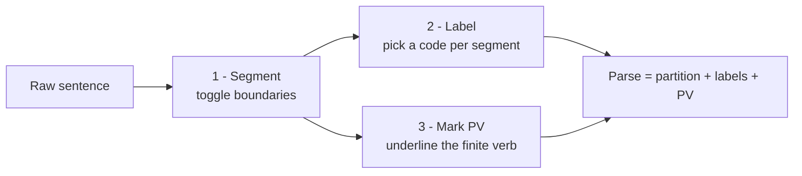
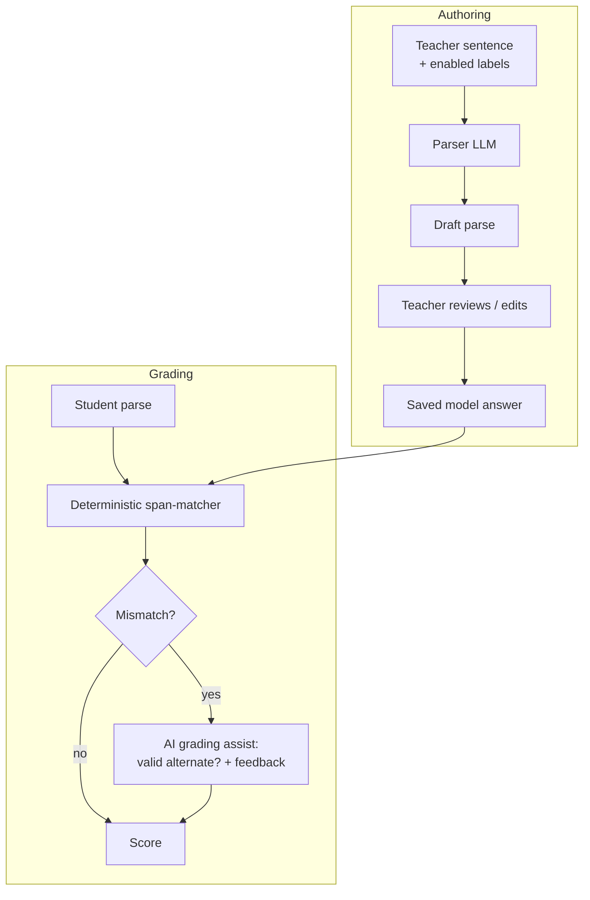

# Feature Spec — `Zin ontleden` (Sentence Analysis) question type

| | |
|---|---|
| **Status** | Draft for review |
| **Product** | Examplary |
| **Subject area** | Nederlands · redekundig ontleden (grammatical sentence analysis) |
| **Source of request** | In-product feedback from Daphne (De Goudse Waarden), 30 Jun 2026 |
| **Reference UX** | Learnbeat "Zin ontleden" werkvorm |
| **Author** | _Thomas_ |

---

## 1. TL;DR

Add a new closed question type that lets a student **split a Dutch sentence into zinsdelen (sentence parts), label each part, and mark the persoonsvorm**. Teachers author a model answer; the system grades automatically with partial credit.

Examplary's differentiator over Learnbeat is the bit Daphne actually asked for — **"zinsontleding met AI"**:

1. **AI-assisted authoring** — one click turns a raw sentence into a proposed parse (segmentation + labels + persoonsvorm) that the teacher reviews and tweaks. No more clicking every stroke by hand.
2. **AI-assisted grading** — beyond exact span matching, the grader can accept grammatically valid alternative parses and return formative feedback explaining *why* a part is wrong.

The deterministic span-matcher remains the scoring backbone; AI is assistive, never the sole arbiter of a grade. That keeps grading fast, free, reproducible, and clean under the EU AI Act.

---

## 2. Background & motivation

> _"Wij zouden heel graag zinsontleding willen doen met AI. Ook dit kan al in Learnbeat, maar we willen het bij jullie doen."_ — Daphne

Redekundig ontleden is a core, recurring exercise in the Dutch onderbouw (here: brugklas → klas 2). It's currently a reason teachers keep a second tool (Learnbeat) open alongside Examplary. Closing this gap:

- removes a concrete switching cost for NL secondary schools,
- plays directly to Examplary's AI-grading strength on a task that is tedious to author and to mark by hand,
- generalises later to **taalkundig ontleden** (word-level word-class labelling) and to other span-labelling tasks (e.g. marking stylistic devices).

This is a **parity-plus** feature: match Learnbeat's interaction model, then add the AI layer.

---

## 3. Goals / Non-goals

### Goals
- A `sentence-analysis` question type a teacher can author in < 1 minute.
- Student can **segment**, **label**, and **mark persoonsvorm** on touch and keyboard.
- **Automatic** grading with **partial credit** (default on).
- **AI authoring assist**: auto-propose the full parse from the raw sentence.
- **AI grading assist**: accept valid alternates + generate per-error feedback.
- Round-trips through Examplary's native question schema; degrades gracefully on QTI export.

### Non-goals (v1)
- Taalkundig ontleden / woordsoorten (separate, later — shares the engine).
- Tree/constituency diagrams (boomdiagrammen). We do a **flat partition**, not nesting.
- Languages other than Dutch. The taxonomy and grammar prompts are NL-specific.
- Multi-sentence passages in a single item (one sentence per item in v1).

---

## 4. Domain glossary (the label taxonomy)

The label palette is exactly the set Learnbeat exposes, plus the persoonsvorm marker. Teachers enable a **subset** per question (only the parts that occur in that sentence).

| Label | Code | English | Grading note |
|---|---|---|---|
| Onderwerp | `OW` | Subject | |
| Werkwoordelijk gezegde | `WG` | Verbal predicate | contains the PV |
| Naamwoordelijk gezegde | `NG` | Nominal predicate | koppelww. + naamwoordelijk deel |
| Lijdend voorwerp | `LV` | Direct object | |
| Meewerkend voorwerp | `MV` | Indirect object | |
| Voorzetselvoorwerp | `VV` | Prepositional object | often confused w/ BWB |
| Bijwoordelijke bepaling | `BWB` | Adverbial adjunct | |
| Bijvoeglijke bepaling | `BVB` | Attributive modifier | sits *inside* a zinsdeel — see §10 |
| Dubbelverbonden bepaling | `DB` | Predicative adjunct (bepaling van gesteldheid) | |
| Voegwoord | `VW` | Conjunction | |
| _Persoonsvorm_ | `PV` | Finite verb | **marker**, not a segment label (underline) |

> **PV is orthogonal to the segment labels.** It's a token-level underline that normally lands inside the `WG`/`NG` span. Treat it as a separate scoring dimension.

---

## 5. The core mechanic

A sentence is a sequence of tokens. The student's job is to produce a **partition** of those tokens into contiguous segments, give each segment a label, and underline the PV.

```
tokens:     Vandaag   maken   wij   de   jaarplanner   voor   klas   2 .
            └──0───┘ └──1──┘ └─2─┘ └3┘  └────4─────┘  └─5─┘ └─6─┘ └7┘8
boundaries:        b0      b1    b2   b3            b4     b5    b6   b7
```

Every inter-token boundary `bᵢ` is a **toggle**: *split* (the two sides are different zinsdelen) or *joined* (same zinsdeel). The set of split boundaries fully determines the segmentation. Default initial state = **fully split** (one segment per word, matching the reference screenshots); the student/teacher merges words together to form multi-word zinsdelen.

Three independent things are being authored/answered:



---

## 6. Authoring flow (teacher)

Mirrors Learnbeat's two-panel flow, with the AI button doing real work.

### 6.1 Authoring panel

```
┌─ Vraag ─────────────────────────────────────────────┐
│ Ontleed de zin en benoem de zinsdelen.              │
└─────────────────────────────────────────────────────┘

┌─ Antwoord ──────────────────────────────────────────┐
│ Schrijf de zin die ontleed moet worden              │
│ ┌─────────────────────────────────────────────────┐ │
│ │ Vandaag maken wij de jaarplanner voor klas 2.   │ │
│ └─────────────────────────────────────────────────┘ │
│                                                     │
│ Selecteer welke onderdelen benoemd moeten worden    │
│  ☑ Onderwerp            ☐ Naamwoordelijk gezegde    │
│  ☑ Lijdend voorwerp     ☐ Dubbelverbonden bepaling  │
│  ☑ Meewerkend voorwerp  ☐ Voorzetselvoorwerp        │
│  ☑ Bijwoordelijke bep.  ☐ Voegwoord                 │
│  ☐ Bijvoeglijke bep.                                │
│  ☑ Werkwoordelijk gezegde                           │
│                                                     │
│ Ontleed de zin                                      │
│  [Vandaag] [maken] [wij] [de jaarplanner voor klas 2.] │
│                                                     │
│   ┌───────────────────────┐                         │
│   │ ✂  Ontleed de zin (AI) │  ← auto-parse          │
│   └───────────────────────┘                         │
└─────────────────────────────────────────────────────┘
```

### 6.2 Steps

1. **Vraag** — instruction text. Presets: *"Ontleed de zin en benoem de zinsdelen"*, *"Verdeel de zin in zinsdelen"*.
2. **Sentence** — the string the student works on.
3. **Enabled labels** — tick the zinsdelen that occur. This scopes the per-segment dropdown (so the student isn't offered impossible labels). Optional toggle: *"Persoonsvorm laten benoemen"*.
4. **Parse** — open the editor. Either:
   - **✂ Ontleed de zin (AI)** → calls the parser, pre-fills segmentation + labels + PV, scoped to the enabled labels. Teacher verifies. *(This is the "met AI" ask.)*
   - **Manual** → click strokes to split, arrow-dropdown to label, click the PV to underline it.
5. **Begin opnieuw** to reset; **Sla op en sluit** to persist the model answer.

> **Human-in-the-loop is mandatory.** The AI parse is a *draft*. The teacher's saved model answer is the source of truth for grading. We never grade students against an unreviewed machine parse.

---

## 7. Student answering flow

```
   ┌─────────┐   ┌───────┐   ┌─────┐   ┌──────────────────────────┐
   │ Vandaag │→|←│ maken │→|←│ wij │→|←│ de  jaarplanner  voor  …  │
   └─────────┘   └───────┘   └─────┘   └──────────────────────────┘
     ▼ BWB         ▼ WG        ▼ O          ▼ LV          ▼ BWB
                  (maken = persoonsvorm, underlined)
```

1. Read the sentence (pre-split into single words).
2. **Merge/split** with the `→|←` boundary controls to form zinsdelen.
3. **Label** each segment via its `▼` dropdown (enabled labels only).
4. **Mark PV** by tapping the finite verb (toggles an underline).
5. Submit.

States to design: empty, partially answered, submitted-locked, graded (with per-segment ✓/✗ and optional feedback), self-check reveal.

---

## 8. Data model

A flat, span-based partition. Token indices are the unit of truth; offsets are kept for clean re-rendering and QTI round-trips.

```ts
type ZinsdeelCode =
  | "OW" | "WG" | "NG" | "LV" | "MV"
  | "VV" | "BWB" | "BVB" | "DB" | "VW";

interface Token {
  index: number;   // 0-based position in the sentence
  text: string;    // surface form, e.g. "jaarplanner"
  start: number;   // char offset into `raw` (inclusive)
  end: number;     // char offset (exclusive)
}

interface Segment {
  startToken: number;          // inclusive
  endToken: number;            // inclusive
  label: ZinsdeelCode | null;  // null = "Geen"
}

interface SentenceParse {
  raw: string;
  tokens: Token[];
  segments: Segment[];                 // ordered, gapless partition of all tokens
  persoonsvorm: TokenRange | null;     // usually a 1-token range inside WG/NG
}
interface TokenRange { startToken: number; endToken: number; }

interface SentenceAnalysisItem {
  type: "sentence-analysis";
  prompt: string;                      // "Ontleed de zin …"
  sentence: string;
  enabledLabels: ZinsdeelCode[];       // from the checkboxes
  requirePersoonsvorm: boolean;
  modelAnswer: SentenceParse;          // canonical, teacher-approved
  alternateAnswers?: SentenceParse[];  // additional accepted parses
  scoring: ScoringConfig;
  explanation?: string;                // shown on review ("uitleg bij het antwoord")
}

interface ScoringConfig {
  gradingMode: "auto" | "self-check" | "none";
  partialCredit: boolean;              // default true
  pointsPerSegment: number;            // each correctly bounded + labelled zinsdeel
  persoonsvormPoints: number;
  aiAssist: {
    acceptValidAlternates: boolean;    // LLM may pass parses not pre-listed
    generateFeedback: boolean;         // per-error formative text
  };
}
```

### Worked example (Daphne's sentence)

`"Vandaag maken wij de jaarplanner voor klas 2."`

| Span | Tokens | Label | PV |
|---|---|---|---|
| Vandaag | 0 | `BWB` | |
| maken | 1 | `WG` | ✓ underline |
| wij | 2 | `OW` | |
| de jaarplanner | 3–4 | `LV` | |
| voor klas 2. | 5–7 | `BWB` | |

> Note the reference screenshot lumps *"de jaarplanner voor klas 2."* into a single `BWB`. That's a simplified demo — the grammatically correct model answer splits `LV` (de jaarplanner) from `BWB` (voor klas 2). Whatever the teacher saves is what we grade against; alternates handle the rest (§10).

### Storage (DynamoDB single-table)

The parse is a self-contained JSON blob — no relational shredding needed. It rides along on the existing question item; the student response is a sibling under the attempt.

| Entity | PK | SK |
|---|---|---|
| Question | `ORG#<org>` | `Q#<questionId>` |
| Student response | `ATTEMPT#<attemptId>` | `RESP#<questionId>` |
| Grade result | `ATTEMPT#<attemptId>` | `GRADE#<questionId>` |

`modelAnswer`, `alternateAnswers`, and the student `SentenceParse` serialise as JSON attributes. Token arrays for a single sentence are tiny — well within item-size limits.

### QTI 3.0 mapping

No native QTI interaction matches zinsontleding. Options, least-effort first:

1. **Native + custom extension** — store the parse natively; on export emit a `customInteraction` carrying the JSON in a private namespace. Lossless within Examplary, opaque to other QTI players. **(Recommended.)**
2. **`graphicGapMatchInteraction` / hottext approximation** — only models segmentation, loses labels cleanly. Not worth it.

The existing JSONata transformer chain can host the native↔QTI mapping; flag this item type as "QTI-export best-effort" in the versioning layer.

---

## 9. AI components



### 9.1 Authoring assist — auto-parse
- **Input:** sentence + `enabledLabels` (+ NL grammar system prompt, few-shot).
- **Output:** strict-JSON `SentenceParse` constrained to enabled labels; rejected/repaired if it returns an out-of-scope label or a non-gapless partition.
- **Validation:** schema-check (gapless, in-bounds, labels ⊆ enabled, PV inside a verbal/nominal predicate). On failure, fall back to per-word segmentation so the teacher just labels manually.
- Reuses the ASAG/grading service plumbing and structured-output handling already in place.

### 9.2 Grading assist
- Runs **only when** the deterministic matcher finds a mismatch *and* `acceptValidAlternates`/`generateFeedback` is on.
- Two jobs: (a) decide whether the student's parse is a *defensible* alternative (e.g. `VV` vs `BWB` borderline); (b) write one short feedback line per error.
- **Never overrides a deterministic ✓.** It can only (a) upgrade a ✗ to ✓ when an alternate is genuinely valid, gated by teacher policy, and (b) annotate.

### 9.3 Compliance note
Grading is a deterministic span-match; AI is a reviewable assist with a human-authored source of truth. Under the EU AI Act this keeps us out of "AI determines the assessment outcome" territory. Log model/version + prompt hash per call for auditability (ties into the assessment audit-log schema).

---

## 10. Grading & scoring

### 10.1 Matching algorithm

```
score = 0
for each model segment Sᵢ:
    find student segment Tⱼ with identical [startToken, endToken]
    if found and Tⱼ.label == Sᵢ.label:
        score += pointsPerSegment
    elif found and partialCredit and boundaries match but label wrong:
        # boundary-only credit is configurable; default: no
        score += 0
if requirePersoonsvorm and student.PV == model.PV:
    score += persoonsvormPoints

maxScore = model.segments.length * pointsPerSegment
         + (requirePersoonsvorm ? persoonsvormPoints : 0)
```

- **Exact-span requirement.** A label only scores on an exactly-bounded segment — wrong boundaries cascade, which is pedagogically correct (a mis-cut zinsdeel *is* wrong).
- **Partial credit (default on).** Each correctly identified-and-labelled zinsdeel earns its points independently, so a student who nails 3 of 5 parts still scores 3/5. This matches Learnbeat's default and the reality that a sentence has several parts.
- **All-or-nothing** available by switching `partialCredit` off.

### 10.2 Scoring dimensions

| Dimension | What's checked | Default weight |
|---|---|---|
| Segmentation + label | exact span boundaries **and** correct code | `pointsPerSegment` each |
| Persoonsvorm | PV token range matches | `persoonsvormPoints` |
| Boundary-only (no label match) | optional consolation credit | off |

### 10.3 Grading modes (parity with Learnbeat)
- **Automatisch nakijken** (`auto`) — default; deterministic + optional AI assist.
- **Leerling kijkt zichzelf na** (`self-check`) — reveal model answer + `explanation`, student self-scores. Good for open/ambiguous sentences.
- **Niet nakijken** (`none`) — evaluative/subjective use.

---

## 11. Edge cases & ambiguity

| Case | Handling |
|---|---|
| Multiple valid parses | `alternateAnswers[]` + AI alternate acceptance. Encourage teachers to enable only the labels that occur, which shrinks ambiguity. |
| `BVB` lives *inside* a zinsdeel | A bijvoeglijke bepaling modifies a noun *within* a larger part (e.g. subject), so a flat partition can't always place it as a sibling. **v1 decision:** treat enabled `BVB` as a label on a sub-span only when the teacher has split it out; document the limitation; revisit with nested spans in v2. |
| Punctuation tokens | Tokenise punctuation as its own token but **attach** trailing punctuation to the preceding segment by default; never let a lone `.` be its own zinsdeel. |
| Capitalisation / whitespace | Normalise for matching; preserve surface form for display. |
| Samentrekking / ellipsis, compound sentences | Out of scope v1 (single clause emphasis). Flag in authoring if the parser detects a finite verb count > 1. |
| Student leaves segments unlabelled | `null` label = scored wrong (not crash); counts against partial-credit total. |
| Empty / one-word sentence | Validate min token count at authoring time. |

---

## 12. Accessibility, i18n, mobile

- **Keyboard:** arrow keys move between boundaries; `Enter`/`Space` toggles split/merge; `1–9` quick-assign the nth enabled label; `u` toggles PV. Full task completable without a pointer.
- **Screen readers:** each segment announces "zinsdeel N van M, woorden …, label …"; boundary controls announce "splitsen/samenvoegen".
- **Touch:** boundary hit-targets ≥ 44px; dropdowns are bottom-sheets on mobile.
- **i18n:** UI strings localisable, but the **grammar engine is NL-only** by design; gate the type to NL course contexts.
- **Colour:** label chips must not rely on colour alone — always show the code text.

---

## 13. Telemetry

Emit scoring events into the existing Firehose → S3 → Athena pipeline:

- per-label confusion (which zinsdelen students mix up — `VV`↔`BWB` is the classic),
- segmentation vs labelling error split,
- AI-alternate acceptance rate + teacher override rate (model-quality signal),
- auto-parse edit distance (how often teachers correct the AI draft → authoring-quality signal).

---

## 14. Phasing

| Phase | Scope |
|---|---|
| **MVP** | Authoring panel, manual + AI auto-parse, student segment/label/PV, deterministic auto-grading with partial credit, self-check & no-grading modes, native storage. |
| **v1.1** | AI grading assist (alternate acceptance + per-error feedback), `alternateAnswers`, explanation field on review, confusion-matrix telemetry. |
| **v2** | Nested `BVB`/embedded modifiers, taalkundig ontleden (woordsoorten) on the same engine, QTI custom-interaction export, compound-sentence support. |

---

## 15. Open questions

1. **Boundary default** — start fully split (per the screenshots) or fully joined (per Learnbeat's article text)? Recommend fully split; confirm with a teacher.
2. **Boundary-only partial credit** — award anything for correct cut but wrong label? Default off; ask the pilot teachers.
3. **`BVB` modelling in v1** — ship the flat-partition limitation, or hold `BVB` for v2 nesting?
4. **Alternate-acceptance policy** — per-question teacher toggle, or org-level default?
5. **Pilot** — Daphne / De Goudse Waarden as design partner for the klas 2 jaarplanner? Worth a direct reply.

---

_Reference: Learnbeat "Werkvorm: Zin ontleden" support documentation and the six in-product screenshots attached to Daphne's feedback._
